# K-Means Clustering of Well Log Data from Hugoton Gas Field, Kansas

## Introduction:
This project was undertaken in order to utilize the capabilities of the K-means clustering algorithm on subsurface well log data from the Hugoton natural gas field in Kansas.  The dataset for this project was acquired from the Kansas Geological Survey (KGS) (http://www.kgs.ku.edu/), and was inspired by a paper I read in the journal of the Society of Exploration Geophysicists(: https://library.seg.org/doi/pdf/10.1190/tle35100906.1).  My motivation for undertaking this project stems mainly from my own interest in geology and the oil and gas exploration business.  I worked as a geoscientist in the petroleum business for more than 20 years, and often wished there were ways to automate processes that were done by hand and were very time consuming and tedious.  I also hoped that perhaps this methodology could yield insights that weren't obvious to the naked eye, even the eye of an experienced geoscientist.
<br>
<br>
The problem this project will try to address is the need to quickly and accurately identify common lithologies or rock types in many wells that share common well log data.  Often, the majority of wells in a field will have the same types of well log data available, and these data could be used to quickly screen all of the wells to identify rock intervals or layers of interest.  This could be for for several purposes: oil/gas content, risks identification, fresh-water aquifer identification, etc.  A method such as K-Means clustering could prove very valuable as a quick screening tool to narrow down areas for greater focus.


## Data:

The data file obtained from the KGS contains subsurface data collected in 8 wells drilled in a large and well-studied gas field in Kansas called the Hugoton Field.  The data file is in comma separated format, and includes the following columns (features):
- Facies
- Formation
- Well Name
- Depth
- GR
- ILD_log10
- DeltaPHI
- PHIND
- PE
- NM_M
- RELPOS
<br>
<br>

The word 'Facies' in this context refers to a rock type, generally associated with a particular environment of deposition.  In this file the values of facies are numbers corresponding to a facies label (e.g. "Dolomite") further described on the KGS website, and assigned to a particular depth in the well.  This facies assignment was most likely done by geoscientists who conducted a detailed analysis of core samples taken from the layers of rock at different depths.  In the case of this project, the Facies feature will first be ignored, and clustering will be performed based on the log curve data to find similar patterns at different depths and in different wells.  Later in the analysis, we will compare the clusters generated by the K-means algorithm to the Facies interpreted at the same depths to see if there are similarities and differences.
<br>
<br>
The next two columns are also categorical variables; 'Formation' refers to the formal name of the rock layer or group of layers, and 'Well Name' is the name of the well from which the observation is taken. The next column is 'Depth' and this is the depth in feet of the observation below the surface.  
<br>
<br>
The next 5 columns are well log "curves" which consist of geophysical data collected by special sensors or "tools" lowered into the borehole after drilling is complete to measure certain qualities of the rock at each depth sample.  For instance, the *GR* or _gamma ray_ log measures the natural gamma radioactivity of the rock and gives important information about the rock type, as different rock types have different content of naturally radioactive minerals. The next 4 columns (ILD, DeltaPHI, PHIND, and PE) are also geophysical logs measuring different electrical and physical properties of the rock in the borehole.  These five features will be the input to the clustering algorithm.
<br>
<br>
The final two features, NM_M and RELPOS will not be used in the analysis.  NM_M is simply a subjective flag of whether the rock is judged to be of marine or nonmarine origin, and RELPOS is some kind of approximation of the relative position of facies with respect to one-another (also subjective).  Since these two features are subjective and of limited utility, they will be ignored for this analysis.

## Methods:
In this notebook, I will import the data, perform any munging or cleanup that is needed, do some exploratory data analysis, and then attempt to use the K-means clustering algorithm to group similar depth samples together based on the similarity of their log data values.  First I will run the clustering algorithm with only the geophysical log data as the input features, and with the same number of clusters as there are classes in the 'Facies' feature.  Then I will compare the clusters generated from the k-means algorithm with the 'Facies' groups.  I will then use the elbow method and silhouette scores to determine the optimum number of clusters.

## Import libraries and data file:


```python
%matplotlib inline
import pandas as pd
import numpy as np
import matplotlib.pyplot as plt
import seaborn as sns
```


```python
data_df = pd.read_csv("kgs_log_data.csv")
data_df.head()
```


<div>
<style scoped>
    .dataframe tbody tr th:only-of-type {
        vertical-align: middle;
    }

    .dataframe tbody tr th {
        vertical-align: top;
    }

    .dataframe thead th {
        text-align: right;
    }
</style>
<table border="1" class="dataframe">
  <thead>
    <tr style="text-align: right;">
      <th></th>
      <th>Facies</th>
      <th>Formation</th>
      <th>Well Name</th>
      <th>Depth</th>
      <th>GR</th>
      <th>ILD_log10</th>
      <th>DeltaPHI</th>
      <th>PHIND</th>
      <th>PE</th>
      <th>NM_M</th>
      <th>RELPOS</th>
    </tr>
  </thead>
  <tbody>
    <tr>
      <td>0</td>
      <td>3</td>
      <td>A1 SH</td>
      <td>SHRIMPLIN</td>
      <td>2793.0</td>
      <td>77.45</td>
      <td>0.664</td>
      <td>9.9</td>
      <td>11.915</td>
      <td>4.6</td>
      <td>1</td>
      <td>1.000</td>
    </tr>
    <tr>
      <td>1</td>
      <td>3</td>
      <td>A1 SH</td>
      <td>SHRIMPLIN</td>
      <td>2793.5</td>
      <td>78.26</td>
      <td>0.661</td>
      <td>14.2</td>
      <td>12.565</td>
      <td>4.1</td>
      <td>1</td>
      <td>0.979</td>
    </tr>
    <tr>
      <td>2</td>
      <td>3</td>
      <td>A1 SH</td>
      <td>SHRIMPLIN</td>
      <td>2794.0</td>
      <td>79.05</td>
      <td>0.658</td>
      <td>14.8</td>
      <td>13.050</td>
      <td>3.6</td>
      <td>1</td>
      <td>0.957</td>
    </tr>
    <tr>
      <td>3</td>
      <td>3</td>
      <td>A1 SH</td>
      <td>SHRIMPLIN</td>
      <td>2794.5</td>
      <td>86.10</td>
      <td>0.655</td>
      <td>13.9</td>
      <td>13.115</td>
      <td>3.5</td>
      <td>1</td>
      <td>0.936</td>
    </tr>
    <tr>
      <td>4</td>
      <td>3</td>
      <td>A1 SH</td>
      <td>SHRIMPLIN</td>
      <td>2795.0</td>
      <td>74.58</td>
      <td>0.647</td>
      <td>13.5</td>
      <td>13.300</td>
      <td>3.4</td>
      <td>1</td>
      <td>0.915</td>
    </tr>
  </tbody>
</table>
</div>


## Data Cleanup:


```python
data_df.dtypes
```


    Facies         int64
    Formation     object
    Well Name     object
    Depth        float64
    GR           float64
    ILD_log10    float64
    DeltaPHI     float64
    PHIND        float64
    PE           float64
    NM_M           int64
    RELPOS       float64
    dtype: object


Since the 'Facies' column integers represent a categorical variable, I will change their data type to categorical.


```python
data_df['Facies'] = data_df['Facies'].astype('category')
```


```python
data_df.describe()
```


<div>
<style scoped>
    .dataframe tbody tr th:only-of-type {
        vertical-align: middle;
    }

    .dataframe tbody tr th {
        vertical-align: top;
    }

    .dataframe thead th {
        text-align: right;
    }
</style>
<table border="1" class="dataframe">
  <thead>
    <tr style="text-align: right;">
      <th></th>
      <th>Depth</th>
      <th>GR</th>
      <th>ILD_log10</th>
      <th>DeltaPHI</th>
      <th>PHIND</th>
      <th>PE</th>
      <th>NM_M</th>
      <th>RELPOS</th>
    </tr>
  </thead>
  <tbody>
    <tr>
      <td>count</td>
      <td>4149.000000</td>
      <td>4149.000000</td>
      <td>4149.000000</td>
      <td>4149.000000</td>
      <td>4149.000000</td>
      <td>3232.000000</td>
      <td>4149.000000</td>
      <td>4149.000000</td>
    </tr>
    <tr>
      <td>mean</td>
      <td>2906.867438</td>
      <td>64.933985</td>
      <td>0.659566</td>
      <td>4.402484</td>
      <td>13.201066</td>
      <td>3.725014</td>
      <td>1.518438</td>
      <td>0.521852</td>
    </tr>
    <tr>
      <td>std</td>
      <td>133.300164</td>
      <td>30.302530</td>
      <td>0.252703</td>
      <td>5.274947</td>
      <td>7.132846</td>
      <td>0.896152</td>
      <td>0.499720</td>
      <td>0.286644</td>
    </tr>
    <tr>
      <td>min</td>
      <td>2573.500000</td>
      <td>10.149000</td>
      <td>-0.025949</td>
      <td>-21.832000</td>
      <td>0.550000</td>
      <td>0.200000</td>
      <td>1.000000</td>
      <td>0.000000</td>
    </tr>
    <tr>
      <td>25%</td>
      <td>2821.500000</td>
      <td>44.730000</td>
      <td>0.498000</td>
      <td>1.600000</td>
      <td>8.500000</td>
      <td>3.100000</td>
      <td>1.000000</td>
      <td>0.277000</td>
    </tr>
    <tr>
      <td>50%</td>
      <td>2932.500000</td>
      <td>64.990000</td>
      <td>0.639000</td>
      <td>4.300000</td>
      <td>12.020000</td>
      <td>3.551500</td>
      <td>2.000000</td>
      <td>0.528000</td>
    </tr>
    <tr>
      <td>75%</td>
      <td>3007.000000</td>
      <td>79.438000</td>
      <td>0.822000</td>
      <td>7.500000</td>
      <td>16.050000</td>
      <td>4.300000</td>
      <td>2.000000</td>
      <td>0.769000</td>
    </tr>
    <tr>
      <td>max</td>
      <td>3138.000000</td>
      <td>361.150000</td>
      <td>1.800000</td>
      <td>19.312000</td>
      <td>84.400000</td>
      <td>8.094000</td>
      <td>2.000000</td>
      <td>1.000000</td>
    </tr>
  </tbody>
</table>
</div>


It appears that the 'PE' column contains fewer valid values (3232) than the other columns (4149).


```python
data_df.isnull().sum()
```


    Facies         0
    Formation      0
    Well Name      0
    Depth          0
    GR             0
    ILD_log10      0
    DeltaPHI       0
    PHIND          0
    PE           917
    NM_M           0
    RELPOS         0
    dtype: int64


I will drop the observations that contain null values for the 'PE' feature:


```python
PE_valid = data_df['PE'].notnull().values
data_df = data_df[PE_valid]
```

## Data Visualization and Exploratory Data Analysis:

First, I will plot the well log data for one well ('SHRIMPLIN') in the format most geoscientists are used to, with depth increasing downward, and each variable plotted in its own narrow 'track'.  I will also plot the facies feature as a separate track consisting of blocks of different colors.  This code was modified from the following source: https://library.seg.org/doi/pdf/10.1190/tle35100906.1


```python
def make_log_plot(logs):
    #make sure logs are sorted by depth
    logs = logs.sort_values(by='Depth')
    
    ztop=logs.Depth.min(); zbot=logs.Depth.max()
    
    cluster=np.repeat(np.expand_dims(logs['Facies'].values,1), 100, 1)
    
    f, ax = plt.subplots(nrows=1, ncols=6, figsize=(8, 12))
    ax[0].plot(logs.GR, logs.Depth, '-g')
    ax[1].plot(logs.ILD_log10, logs.Depth, '-')
    ax[2].plot(logs.DeltaPHI, logs.Depth, '-', color='0.5')
    ax[3].plot(logs.PHIND, logs.Depth, '-', color='r')
    ax[4].plot(logs.PE, logs.Depth, '-', color='black')
    im=ax[5].imshow(cluster, interpolation='none', aspect='auto',vmin=1,vmax=9)
    
    for i in range(len(ax)-1):
        ax[i].set_ylim(ztop,zbot)
        ax[i].invert_yaxis()
        ax[i].grid()
        ax[i].locator_params(axis='x', nbins=3)
    
    ax[0].set_xlabel("GR")
    ax[0].set_xlim(logs.GR.min()-20,logs.GR.max()+20)
    ax[1].set_xlabel("ILD_log10")
    ax[1].set_xlim(logs.ILD_log10.min(),logs.ILD_log10.max())
    ax[2].set_xlabel("DeltaPHI")
    ax[2].set_xlim(logs.DeltaPHI.min(),logs.DeltaPHI.max())
    ax[3].set_xlabel("PHIND")
    ax[3].set_xlim(logs.PHIND.min(),logs.PHIND.max())
    ax[4].set_xlabel("PE")
    ax[4].set_xlim(logs.PE.min(),logs.PE.max())
    ax[5].set_xlabel('Facies')
    
    ax[1].set_yticklabels([]); ax[2].set_yticklabels([]); ax[3].set_yticklabels([])
    ax[4].set_yticklabels([]); ax[5].set_yticklabels([])
    ax[5].set_xticklabels([])
    f.suptitle('Well: %s'%logs.iloc[0]['Well Name'], fontsize=14,y=0.94)
```


```python
data_df['Well Name'].unique()
```


    array(['SHRIMPLIN', 'SHANKLE', 'LUKE G U', 'CROSS H CATTLE', 'NOLAN',
           'Recruit F9', 'NEWBY', 'CHURCHMAN BIBLE'], dtype=object)


```python
make_log_plot(data_df[data_df['Well Name'] == 'SHRIMPLIN'])
```


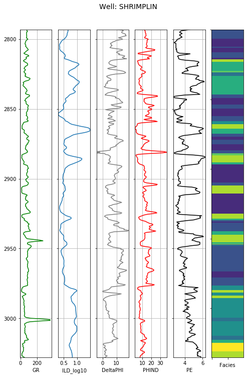


This method of plotting is useful, especially when looking at multiple wells and correlating similar rock layers.  It also allows for visual pattern recognition.
<br>
<br>
Next I will plot histograms of the different features to inspect the distributions.


```python
fig = plt.figure(figsize = (8,8))
ax = fig.gca()
data_df.drop(['Facies','Formation','Well Name','NM_M','RELPOS'], axis=1).hist(ax=ax)
plt.show()
```

    C:\Users\akwoh\Anaconda3\lib\site-packages\ipykernel_launcher.py:3: UserWarning: To output multiple subplots, the figure containing the passed axes is being cleared
      This is separate from the ipykernel package so we can avoid doing imports until
    


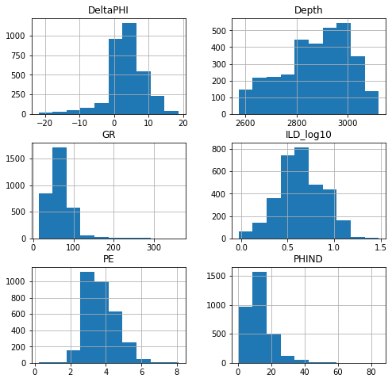


Next, let's look at the distributions of each feature for one well, and also cross-plot the features against one-another.  Let's look at the first well, 'SHRIMPLIN':


```python
sns.pairplot(data_df[data_df['Well Name']=='SHRIMPLIN']
             .drop(['Facies','Formation','Depth','NM_M','RELPOS'], axis=1))
```


    <seaborn.axisgrid.PairGrid at 0x19fbccbbac8>


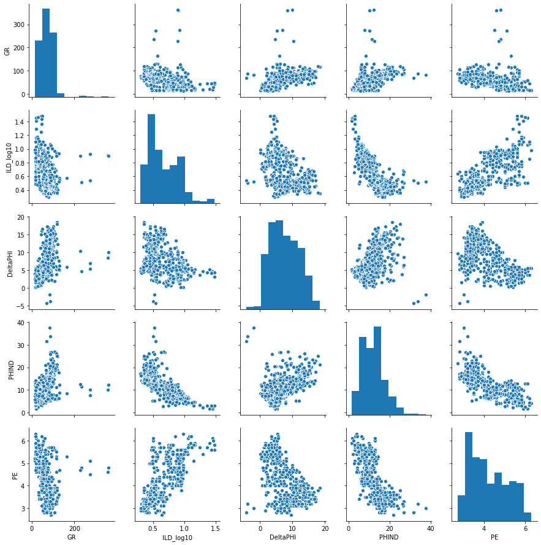


Now let's look at all of the wells' data together, with the data points colored by well name:


```python
sns.pairplot(data_df.drop(['Facies','Formation','Depth','NM_M','RELPOS'], 
                          axis=1), hue='Well Name', palette='bright')
```


    <seaborn.axisgrid.PairGrid at 0x19fbf9300c8>


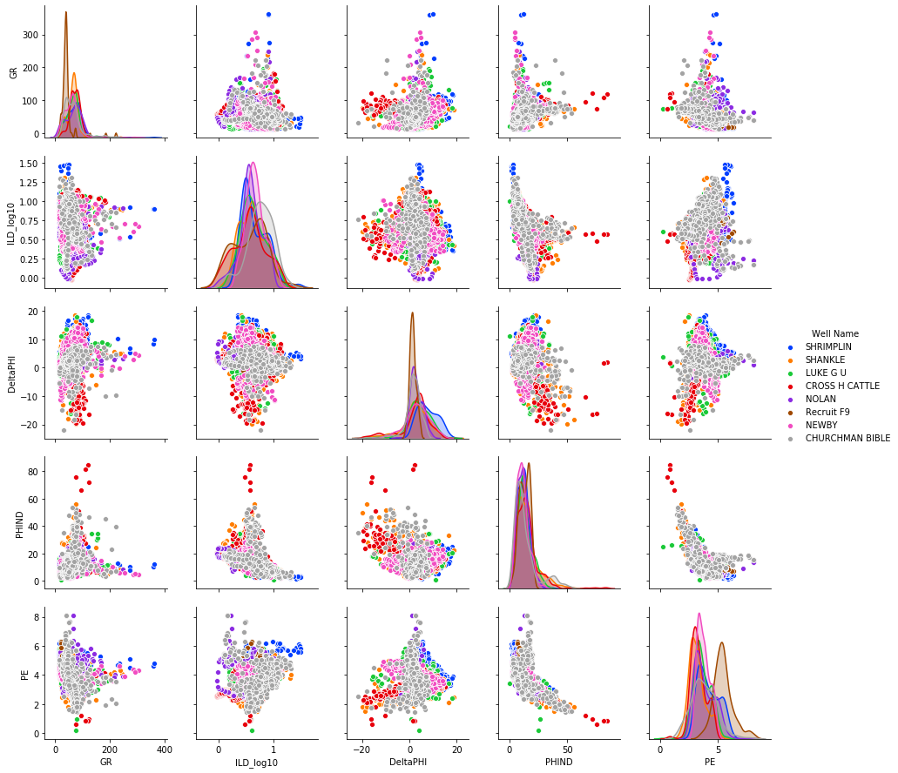


The by-well histograms of the feature data tend to overlay one another with the exception of 'Recruit F9' well which appears to have an offset distribution of the PE variable relative to the other wells.
<br>
None of the scatter plots of pairs of features show obvious clusters that can be broken out visually, but I am hoping that the K-means algorithm can find meaningful clusters in the data that might yield insights into similar reservoir characteristics within the same well, as well as correlating reservoir zones in the other wells.

## K-means Clustering:


```python
from sklearn import preprocessing
from sklearn.preprocessing import MinMaxScaler
from sklearn.cluster import KMeans
from scipy.spatial.distance import cdist
```

First, I will prepare the data for the clustering algorithm.  First I will drop the columns that will not be used for clustering.


```python
print(list(data_df.columns))
```

    ['Facies', 'Formation', 'Well Name', 'Depth', 'GR', 'ILD_log10', 'DeltaPHI', 'PHIND', 'PE', 'NM_M', 'RELPOS']
    


```python
features_clust = data_df.drop(['Facies', 'Formation', 'Well Name', 'Depth','NM_M', 'RELPOS'], axis=1)
features_clust.head()
```


<div>
<style scoped>
    .dataframe tbody tr th:only-of-type {
        vertical-align: middle;
    }

    .dataframe tbody tr th {
        vertical-align: top;
    }

    .dataframe thead th {
        text-align: right;
    }
</style>
<table border="1" class="dataframe">
  <thead>
    <tr style="text-align: right;">
      <th></th>
      <th>GR</th>
      <th>ILD_log10</th>
      <th>DeltaPHI</th>
      <th>PHIND</th>
      <th>PE</th>
    </tr>
  </thead>
  <tbody>
    <tr>
      <td>0</td>
      <td>77.45</td>
      <td>0.664</td>
      <td>9.9</td>
      <td>11.915</td>
      <td>4.6</td>
    </tr>
    <tr>
      <td>1</td>
      <td>78.26</td>
      <td>0.661</td>
      <td>14.2</td>
      <td>12.565</td>
      <td>4.1</td>
    </tr>
    <tr>
      <td>2</td>
      <td>79.05</td>
      <td>0.658</td>
      <td>14.8</td>
      <td>13.050</td>
      <td>3.6</td>
    </tr>
    <tr>
      <td>3</td>
      <td>86.10</td>
      <td>0.655</td>
      <td>13.9</td>
      <td>13.115</td>
      <td>3.5</td>
    </tr>
    <tr>
      <td>4</td>
      <td>74.58</td>
      <td>0.647</td>
      <td>13.5</td>
      <td>13.300</td>
      <td>3.4</td>
    </tr>
  </tbody>
</table>
</div>


```python
fig = plt.figure(figsize = (8,8))
ax = fig.gca()
features_clust.hist(ax=ax)
plt.show()
```

    C:\Users\akwoh\Anaconda3\lib\site-packages\ipykernel_launcher.py:3: UserWarning: To output multiple subplots, the figure containing the passed axes is being cleared
      This is separate from the ipykernel package so we can avoid doing imports until
    


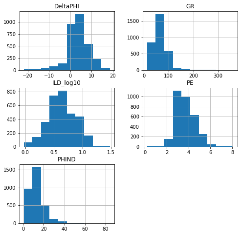


## Scale the features:


```python
scaler = preprocessing.StandardScaler().fit(features_clust)
scaled_clust = scaler.transform(features_clust)
```


```python
fig = plt.figure(figsize = (8,8))
ax = fig.gca()
pd.DataFrame(scaled_clust).hist(ax=ax)
plt.show()
```

    C:\Users\akwoh\Anaconda3\lib\site-packages\ipykernel_launcher.py:3: UserWarning: To output multiple subplots, the figure containing the passed axes is being cleared
      This is separate from the ipykernel package so we can avoid doing imports until
    


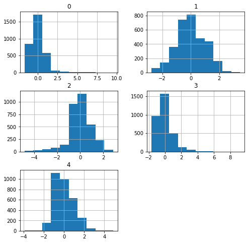


## Run the K-means clustering algorithm on the scaled features:


```python
#clust_kmeans = KMeans(n_clusters=9, verbose=1)
clust_kmeans = KMeans(n_clusters=9, init='k-means++')
clust_kmeans.fit(scaled_clust)

```


    KMeans(algorithm='auto', copy_x=True, init='k-means++', max_iter=300,
           n_clusters=9, n_init=10, n_jobs=None, precompute_distances='auto',
           random_state=None, tol=0.0001, verbose=0)


```python
clust_labels = clust_kmeans.labels_
```


```python
clust_labels.shape
```


    (3232,)


## Visualize the clusters:


```python
data_df['ClusterLabels']=clust_labels
data_df.head()
```


<div>
<style scoped>
    .dataframe tbody tr th:only-of-type {
        vertical-align: middle;
    }

    .dataframe tbody tr th {
        vertical-align: top;
    }

    .dataframe thead th {
        text-align: right;
    }
</style>
<table border="1" class="dataframe">
  <thead>
    <tr style="text-align: right;">
      <th></th>
      <th>Facies</th>
      <th>Formation</th>
      <th>Well Name</th>
      <th>Depth</th>
      <th>GR</th>
      <th>ILD_log10</th>
      <th>DeltaPHI</th>
      <th>PHIND</th>
      <th>PE</th>
      <th>NM_M</th>
      <th>RELPOS</th>
      <th>ClusterLabels</th>
    </tr>
  </thead>
  <tbody>
    <tr>
      <td>0</td>
      <td>3</td>
      <td>A1 SH</td>
      <td>SHRIMPLIN</td>
      <td>2793.0</td>
      <td>77.45</td>
      <td>0.664</td>
      <td>9.9</td>
      <td>11.915</td>
      <td>4.6</td>
      <td>1</td>
      <td>1.000</td>
      <td>2</td>
    </tr>
    <tr>
      <td>1</td>
      <td>3</td>
      <td>A1 SH</td>
      <td>SHRIMPLIN</td>
      <td>2793.5</td>
      <td>78.26</td>
      <td>0.661</td>
      <td>14.2</td>
      <td>12.565</td>
      <td>4.1</td>
      <td>1</td>
      <td>0.979</td>
      <td>2</td>
    </tr>
    <tr>
      <td>2</td>
      <td>3</td>
      <td>A1 SH</td>
      <td>SHRIMPLIN</td>
      <td>2794.0</td>
      <td>79.05</td>
      <td>0.658</td>
      <td>14.8</td>
      <td>13.050</td>
      <td>3.6</td>
      <td>1</td>
      <td>0.957</td>
      <td>2</td>
    </tr>
    <tr>
      <td>3</td>
      <td>3</td>
      <td>A1 SH</td>
      <td>SHRIMPLIN</td>
      <td>2794.5</td>
      <td>86.10</td>
      <td>0.655</td>
      <td>13.9</td>
      <td>13.115</td>
      <td>3.5</td>
      <td>1</td>
      <td>0.936</td>
      <td>2</td>
    </tr>
    <tr>
      <td>4</td>
      <td>3</td>
      <td>A1 SH</td>
      <td>SHRIMPLIN</td>
      <td>2795.0</td>
      <td>74.58</td>
      <td>0.647</td>
      <td>13.5</td>
      <td>13.300</td>
      <td>3.4</td>
      <td>1</td>
      <td>0.915</td>
      <td>2</td>
    </tr>
  </tbody>
</table>
</div>


```python
cluster_counts = data_df['ClusterLabels'].value_counts().sort_index()
#use facies labels to index each count
#facies_counts.index = facies_labels

cluster_counts.plot(kind='bar',title='Distribution of Data by Cluster')
cluster_counts
```


    0    664
    1    301
    2    578
    3    152
    4    373
    5    218
    6    639
    7     64
    8    243
    Name: ClusterLabels, dtype: int64


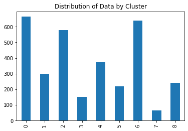


```python
sns.pairplot(data_df.drop(['Facies','Formation','Depth','NM_M','RELPOS'], 
                          axis=1), hue='ClusterLabels', palette='bright')
```

    C:\Users\akwoh\Anaconda3\lib\site-packages\statsmodels\nonparametric\kde.py:487: RuntimeWarning: invalid value encountered in true_divide
      binned = fast_linbin(X, a, b, gridsize) / (delta * nobs)
    C:\Users\akwoh\Anaconda3\lib\site-packages\statsmodels\nonparametric\kdetools.py:34: RuntimeWarning: invalid value encountered in double_scalars
      FAC1 = 2*(np.pi*bw/RANGE)**2
    


    <seaborn.axisgrid.PairGrid at 0x246cb48ff88>


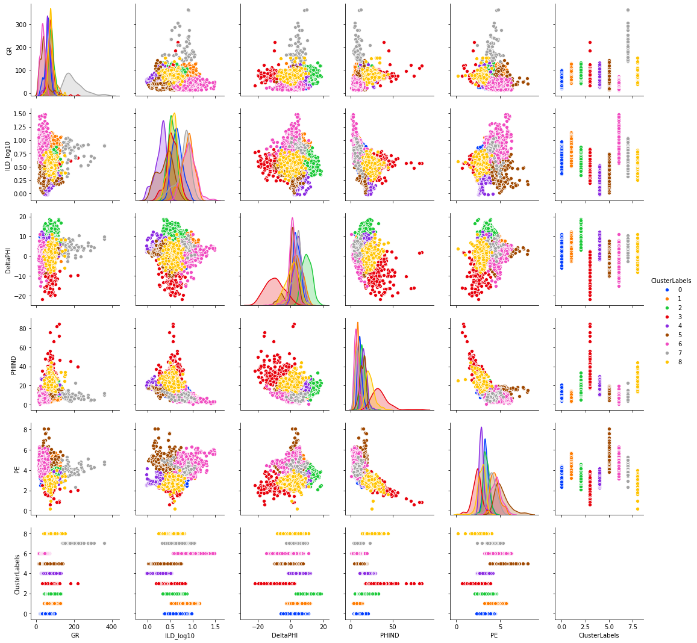


### Compare clusters to facies classes using completeness and homogeneity:


```python
data_df.head()
```


<div>
<style scoped>
    .dataframe tbody tr th:only-of-type {
        vertical-align: middle;
    }

    .dataframe tbody tr th {
        vertical-align: top;
    }

    .dataframe thead th {
        text-align: right;
    }
</style>
<table border="1" class="dataframe">
  <thead>
    <tr style="text-align: right;">
      <th></th>
      <th>Facies</th>
      <th>Formation</th>
      <th>Well Name</th>
      <th>Depth</th>
      <th>GR</th>
      <th>ILD_log10</th>
      <th>DeltaPHI</th>
      <th>PHIND</th>
      <th>PE</th>
      <th>NM_M</th>
      <th>RELPOS</th>
      <th>ClusterLabels</th>
    </tr>
  </thead>
  <tbody>
    <tr>
      <td>0</td>
      <td>3</td>
      <td>A1 SH</td>
      <td>SHRIMPLIN</td>
      <td>2793.0</td>
      <td>77.45</td>
      <td>0.664</td>
      <td>9.9</td>
      <td>11.915</td>
      <td>4.6</td>
      <td>1</td>
      <td>1.000</td>
      <td>2</td>
    </tr>
    <tr>
      <td>1</td>
      <td>3</td>
      <td>A1 SH</td>
      <td>SHRIMPLIN</td>
      <td>2793.5</td>
      <td>78.26</td>
      <td>0.661</td>
      <td>14.2</td>
      <td>12.565</td>
      <td>4.1</td>
      <td>1</td>
      <td>0.979</td>
      <td>2</td>
    </tr>
    <tr>
      <td>2</td>
      <td>3</td>
      <td>A1 SH</td>
      <td>SHRIMPLIN</td>
      <td>2794.0</td>
      <td>79.05</td>
      <td>0.658</td>
      <td>14.8</td>
      <td>13.050</td>
      <td>3.6</td>
      <td>1</td>
      <td>0.957</td>
      <td>2</td>
    </tr>
    <tr>
      <td>3</td>
      <td>3</td>
      <td>A1 SH</td>
      <td>SHRIMPLIN</td>
      <td>2794.5</td>
      <td>86.10</td>
      <td>0.655</td>
      <td>13.9</td>
      <td>13.115</td>
      <td>3.5</td>
      <td>1</td>
      <td>0.936</td>
      <td>2</td>
    </tr>
    <tr>
      <td>4</td>
      <td>3</td>
      <td>A1 SH</td>
      <td>SHRIMPLIN</td>
      <td>2795.0</td>
      <td>74.58</td>
      <td>0.647</td>
      <td>13.5</td>
      <td>13.300</td>
      <td>3.4</td>
      <td>1</td>
      <td>0.915</td>
      <td>2</td>
    </tr>
  </tbody>
</table>
</div>


```python
facies = data_df['Facies']
clusters = data_df['ClusterLabels']
```


```python
from sklearn.metrics import completeness_score, homogeneity_score
```


```python
print(completeness_score(facies,clusters))
```

    0.29208594058357296
    


```python
print(homogeneity_score(facies,clusters))
```

    0.2921110756396894
    

**The completeness score approaches 1 when most of the data points that are members of a given class are elements of the same cluster while the homogeneity score approaches 1 when all the clusters contain almost only data points that are member of a single class.**
<br>
<br>
These scores for completeness and homogeneity of ~0.29 imply that there is not alot of good matching between the classes predicted by clustering and the facies assigned by geologists analyzing core samples.  This isn't too surprising since the facies were not assigned from the well log data that the clustering algorithm is using.

## Rerun with multiple k values; use elbow method to find best number of clusters.


```python
from sklearn import metrics
from scipy.spatial.distance import cdist
```


```python
distortions = []
k_range = range(1,12)
for k in k_range:
    kmeanModel = KMeans(n_clusters=k).fit(scaled_clust)
    kmeanModel.fit(scaled_clust)
    distortions.append(sum(np.min(cdist(scaled_clust, kmeanModel.cluster_centers_, 'euclidean'), axis=1)) / scaled_clust.shape[0])

# Plot the elbow
plt.plot(k_range, distortions, 'bx-')
plt.xlabel('k')
plt.ylabel('Distortion')
plt.title('The Elbow Method showing the optimal k')
plt.show()
```


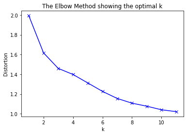


The results of the elbow method in this case are somewhat ambiguous.  A good case can be made from the plot that k=3 is the optimal number of clusters for this dataset.  But it can also be argued that only splitting into three clusters is not very informative for the purpose of identifying geologic groupings.  For instance, the facies interpretations made from the core samples indicated 9 facies or groupings of depth samples.  In the plot above, there is the hint of a second, subtler elbow point at k=7 that might be worth exploring.

## Examine silhouette scores:


```python
from sklearn.metrics import silhouette_samples, silhouette_score
```


```python
silhouettes = []
k_range = range(2,12)
for i in k_range:
    clusterer = KMeans(n_clusters=i, random_state=1234)
    cluster_labels = clusterer.fit_predict(scaled_clust)
    silhouette_avg = silhouette_score(scaled_clust, cluster_labels)
    silhouettes.append(silhouette_avg)
    print("For n_clusters =", i,
         "The average silhouette_score is :", silhouette_avg)
```

    For n_clusters = 2 The average silhouette_score is : 0.2980973158360799
    For n_clusters = 3 The average silhouette_score is : 0.3283572639411073
    For n_clusters = 4 The average silhouette_score is : 0.34637505435477933
    For n_clusters = 5 The average silhouette_score is : 0.3355163839445572
    For n_clusters = 6 The average silhouette_score is : 0.2587291680368065
    For n_clusters = 7 The average silhouette_score is : 0.24533518600008183
    For n_clusters = 8 The average silhouette_score is : 0.24531193016322025
    For n_clusters = 9 The average silhouette_score is : 0.24959855879347356
    For n_clusters = 10 The average silhouette_score is : 0.24121570732336442
    For n_clusters = 11 The average silhouette_score is : 0.2443874388717967
    


```python
plt.plot(k_range, silhouettes)
plt.xlabel('k')
plt.ylabel('Silhouette Average')
plt.title('Silhouette average versus k')
plt.show()
```


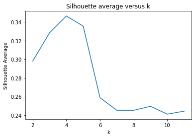


Silhouette analysis suggests the optimal number of k-means for this dataset is k=4.


```python
from mpl_toolkits.axes_grid1 import make_axes_locatable
```


```python
def compare_clusters_plot(logs):
    #make sure logs are sorted by depth
    logs = logs.sort_values(by='Depth')
    
    ztop=logs.Depth.min(); zbot=logs.Depth.max()
    
    cluster1 = np.repeat(np.expand_dims(logs['Facies'].values,1), 100, 1)
    cluster2 = np.repeat(np.expand_dims(logs['ClusterLabels'].values,1), 100, 1)
    
    f, ax = plt.subplots(nrows=1, ncols=7, figsize=(9, 12))
    ax[0].plot(logs.GR, logs.Depth, '-g')
    ax[1].plot(logs.ILD_log10, logs.Depth, '-')
    ax[2].plot(logs.DeltaPHI, logs.Depth, '-', color='0.5')
    ax[3].plot(logs.PHIND, logs.Depth, '-', color='r')
    ax[4].plot(logs.PE, logs.Depth, '-', color='black')
    im1 = ax[5].imshow(cluster1, interpolation='none', aspect='auto',vmin=1,vmax=9)
    im2 = ax[6].imshow(cluster2, interpolation='none', aspect='auto',vmin=1,vmax=9)
    
    for i in range(len(ax)-2):
        ax[i].set_ylim(ztop,zbot)
        ax[i].invert_yaxis()
        ax[i].grid()
        ax[i].locator_params(axis='x', nbins=3)
    
    ax[0].set_xlabel("GR")
    ax[0].set_xlim(logs.GR.min(),logs.GR.max())
    ax[1].set_xlabel("ILD_log10")
    ax[1].set_xlim(logs.ILD_log10.min(),logs.ILD_log10.max())
    ax[2].set_xlabel("DeltaPHI")
    ax[2].set_xlim(logs.DeltaPHI.min(),logs.DeltaPHI.max())
    ax[3].set_xlabel("PHIND")
    ax[3].set_xlim(logs.PHIND.min(),logs.PHIND.max())
    ax[4].set_xlabel("PE")
    ax[4].set_xlim(logs.PE.min(),logs.PE.max())
    ax[5].set_xlabel('Facies')
    ax[6].set_xlabel('ClusterLabels')
    
    ax[1].set_yticklabels([]); ax[2].set_yticklabels([]); ax[3].set_yticklabels([])
    ax[4].set_yticklabels([]); ax[5].set_yticklabels([])
    ax[5].set_xticklabels([])
    ax[6].set_xticklabels([])
    f.suptitle('Well: %s'%logs.iloc[0]['Well Name'], fontsize=14,y=0.94)
```


```python
compare_clusters_plot(data_df[data_df['Well Name'] == 'SHRIMPLIN'])
```


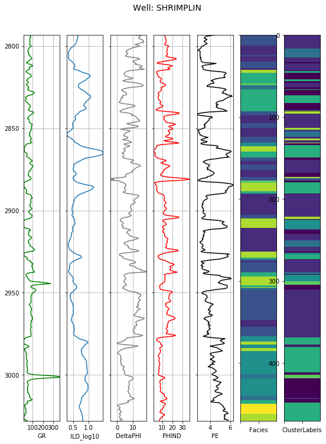


It is difficult to compare the 'Facies' and 'ClusterLabels' tracks because the colors don't match up.  It would be easier to compare if I could map the most likely matching 'Facies' and 'ClusterLabels' values to one another so that they shared the same color on both tracks, but I haven't figured out how to do that yet.  But it does appear that the clustering algorithm has identified similar blocks of data as were identified as being of the same facies.  So k-means clustering could be useful as a way of quickly flagging similar rock layers in many wells that have the same well log data available.


```python
facies1 = data_df[data_df['Facies']==1]
facies1_counts = facies1['ClusterLabels'].value_counts().sort_index()
facies1_counts.plot(kind='bar',title='Distribution of Clusters for Facies = 1')
facies1_counts
```


    0      5
    2      2
    3     68
    5      9
    8    175
    Name: ClusterLabels, dtype: int64


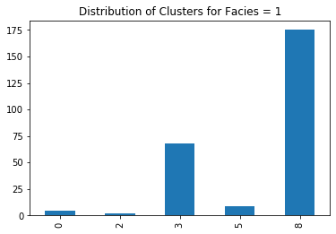


This suggests that _Facies 1_ most likely maps to _Cluster 8_.


```python
facies2 = data_df[data_df['Facies']==2]
facies2_counts = facies2['ClusterLabels'].value_counts().sort_index()
facies2_counts.plot(kind='bar',title='Distribution of Clusters for Facies = 2')
facies2_counts
```


    0     80
    2     34
    3    261
    4      1
    5    235
    6     10
    8    117
    Name: ClusterLabels, dtype: int64


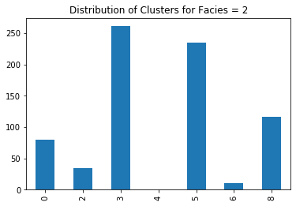


```python
facies3 = data_df[data_df['Facies']==3]
facies3_counts = facies3['ClusterLabels'].value_counts().sort_index()
facies3_counts.plot(kind='bar',title='Distribution of Clusters for Facies = 3')
facies3_counts
```


    0    139
    1      5
    2    101
    3     77
    4      5
    5    240
    6     12
    7      1
    8     35
    Name: ClusterLabels, dtype: int64


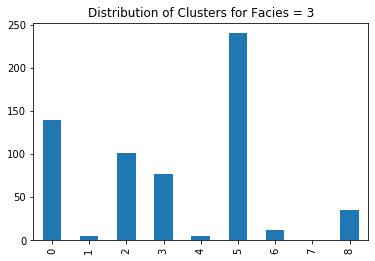


```python
facies4 = data_df[data_df['Facies']==4]
facies4_counts = facies4['ClusterLabels'].value_counts().sort_index()
facies4_counts.plot(kind='bar',title='Distribution of Clusters for Facies = 4')
facies4_counts
```


    0     3
    1     8
    2     1
    3    60
    5    30
    6    57
    7    24
    8     1
    Name: ClusterLabels, dtype: int64


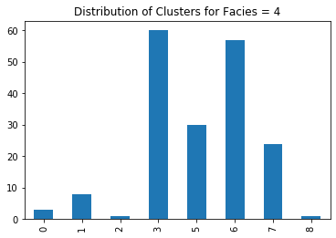


```python
facies5 = data_df[data_df['Facies']==5]
facies5_counts = facies5['ClusterLabels'].value_counts().sort_index()
facies5_counts.plot(kind='bar',title='Distribution of Clusters for Facies = 5')
facies5_counts
```


    0     7
    1    88
    2     6
    3    29
    4     5
    5    15
    6    53
    7     9
    8     5
    Name: ClusterLabels, dtype: int64


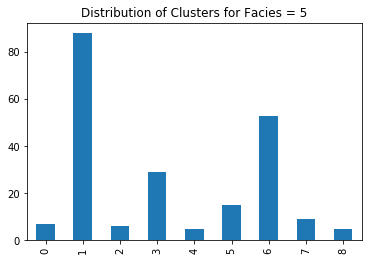


```python
facies6 = data_df[data_df['Facies']==6]
facies6_counts = facies6['ClusterLabels'].value_counts().sort_index()
facies6_counts.plot(kind='bar',title='Distribution of Clusters for Facies = 6')
facies6_counts
```


    0      1
    1    244
    3     74
    4     14
    5     14
    6    103
    7      7
    8      5
    Name: ClusterLabels, dtype: int64


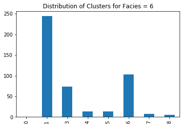


```python
facies7 = data_df[data_df['Facies']==7]
facies7_counts = facies7['ClusterLabels'].value_counts().sort_index()
facies7_counts.plot(kind='bar',title='Distribution of Clusters for Facies = 7')
facies7_counts
```


    0     1
    1     5
    2     3
    3    21
    4    16
    5    15
    6     1
    7     9
    8    27
    Name: ClusterLabels, dtype: int64


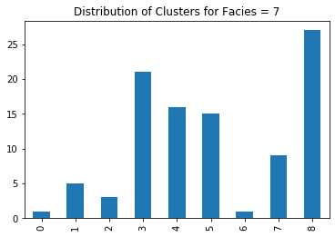


```python
facies8 = data_df[data_df['Facies']==8]
facies8_counts = facies8['ClusterLabels'].value_counts().sort_index()
facies8_counts.plot(kind='bar',title='Distribution of Clusters for Facies = 8')
facies8_counts
```


    0      8
    1    244
    2      5
    3     70
    4     89
    5      9
    6     59
    7     10
    8      4
    Name: ClusterLabels, dtype: int64


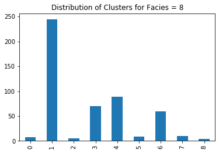


```python
facies9 = data_df[data_df['Facies']==9]
facies9_counts = facies9['ClusterLabels'].value_counts().sort_index()
facies9_counts.plot(kind='bar',title='Distribution of Clusters for Facies = 9')
facies9_counts
```


    1    55
    3     1
    4    94
    6     7
    7     4
    Name: ClusterLabels, dtype: int64


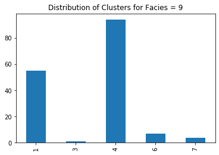


```python

```
